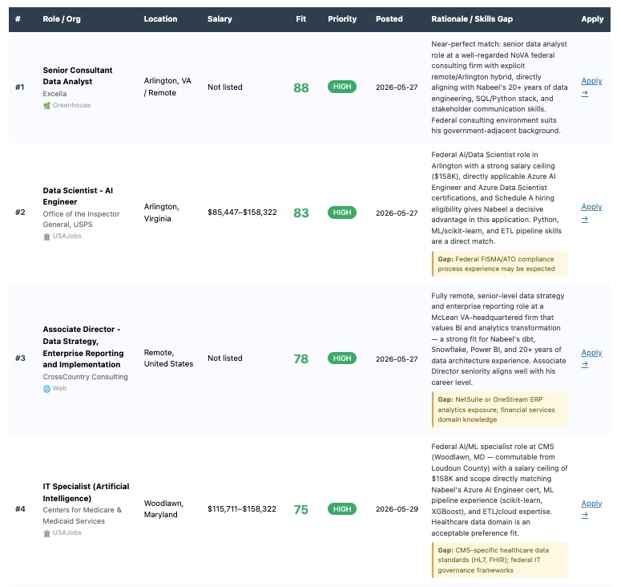

# Job Hunter Agent — Nabeel Keblawi

Scans your favorite employer career pages on command, scores every listing against your profile
using Claude, and emails you the top N results with fit score, rationale, and a
concrete skills gap for each role.



---

## Quick Start

```bash
# 1. Activate the virtual environment (contains all required dependencies)
source jh/bin/activate

# 2. Fill in config.yaml (see Configuration below)

# 3. Run
python job_hunter.py              # top 10 results (default)
python job_hunter.py -n 5        # top 5
python job_hunter.py -n 20       # top 20
python job_hunter.py --help
```

---

## Configuration (config.yaml)

Four things to fill in before first run:

```yaml
email:
  from:     "your.gmail@gmail.com"       # Gmail you're sending FROM
  username: "your.gmail@gmail.com"       # same address
  password: "xxxx xxxx xxxx xxxx"        # 16-char Gmail App Password (NOT your real password)
                                         # Get it: https://myaccount.google.com/apppasswords

anthropic_api_key: "sk-ant-..."          # console.anthropic.com → API Keys
                                         # Set to "ENV" to use ANTHROPIC_API_KEY env var instead

usajobs_api_key: "YOUR_USAJOBS_API_KEY"  # ← paste your USAJobs key here
usajobs_email:   "your.gmail@gmail.com"  # must match the email you used to request the key
```

Everything else (prompts, org lists) is tunable but works out of the box.

---

## Sources

| Source | Count | Method | Notes |
|---|---|---|---|
| 🌿 Greenhouse API | 14 orgs | Free public GET API | Most reliable; no scraping |
| 🌐 HTML scraping | 48 orgs | Polite scraping (1 req/day) | Static pages work well; Workday/iCIMS may be JS-rendered |
| 🏛️ USAJobs API | Federal listings | Official REST API | Requires free API key |

JS-rendered pages (Workday, iCIMS, Taleo) return empty — the email warnings
section flags these so you can check them manually.

---

## Email Output

Each listing in the email shows:
- **Fit score** (0–100) and **priority** badge (HIGH / MEDIUM / LOW)
- **Rationale** — 2-sentence honest assessment specific to that listing
- **Skills Gap** — amber callout listing only what you're missing for that role
  (suppressed if gap is "None")
- **Flags** — any hard disqualifiers (on-call, relocation, salary, etc.)
- **Apply link**

---

## Org Site Types

**Federal Agencies (use USAJobs API):** - best served by the USAJobs API source; HTML is a fallback
```yaml
federal_orgs:
  - name: "NOAA"
    agency_code: "CM"
    keywords: ["physical scientist", "meteorologist"]

  - name: "USGS"
    agency_code: "GS"
    keywords: ["operations research analyst", "geologist"]

  - name: "EPA"
    agency_code: "EP"
    keywords: ["physical scientist", "environmental scientist"]

  - name: "NASA"
    agency_code: "NN"
    keywords: ["program analyst"]

  - name: "DOE"
    agency_code: "EN"
    keywords: ["data scientist", "data engineer", "program analyst"]
```

**Greenhouse**:
```yaml
greenhouse_orgs:
  - name: "Company Name"
    board_token: "slug"   # verify: https://boards.greenhouse.io/SLUG
```

**HTML fallback:**
```yaml
html_orgs:
  - name: "Org Name"
    careers_url: "https://careers.example.com/jobs"
```

---

## Cost

~$0.10–0.25 per run depending on how many listings are found.
Uses claude-sonnet-4-20250514, max_tokens 1000 per scoring batch.

---

## Tuning

All scoring behavior lives in `config.yaml` under `prompts:` — edit freely:
- `candidate_profile` — your background, hard non-negotiables, preferences
- `score_system` — scoring rules for Greenhouse + USAJobs listings
- `html_extract_system` — extraction + scoring rules for HTML pages

No need to touch `job_hunter.py` for routine tuning.
